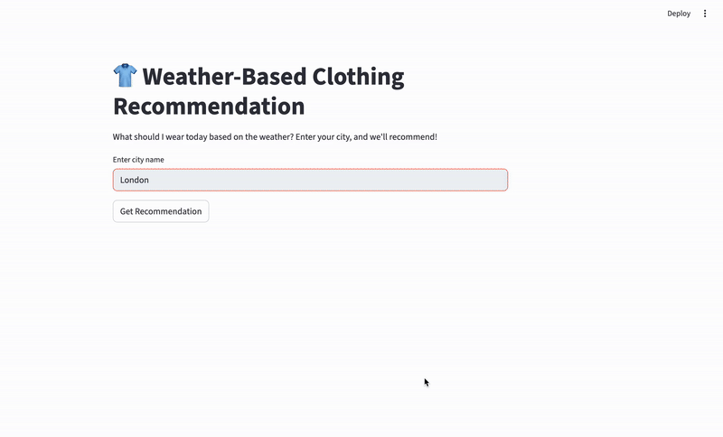

# 👕 Weather-Based Clothing Recommendation

An AI-powered web application that provides personalized clothing recommendations based on real-time weather data using LangChain agents and Streamlit.

## Features

- Real-time weather data from WeatherAPI
- Smart clothing recommendations using OpenAI GPT-4
- Clean and intuitive Streamlit interface
- Supports any city worldwide
- Considers temperature, weather conditions, and special factors (rain, wind, etc.)

## 🎬 Demo



*Click to watch how the outfit recommendation system works*

## Installation

1. **Clone and install dependencies:**
   ```bash
   git clone https://github.com/uygaraydin/outfit-recommendation-system.git
   cd outfit-recommendation-system
   pip install -r requirements.txt
   ```

2. **Set up environment variables:**
   Create a `.env` file:
   ```env
   OPENAI_API_KEY=your_openai_api_key
   WEATHERAPI_KEY=your_weatherapi_key
   LANGCHAIN_API_KEY=your_langchain_api_key
   ```

3. **Get your API keys:**
   - **OpenAI API**: https://platform.openai.com/
   - **WeatherAPI**: https://www.weatherapi.com/ (free tier available)
   - **LangChain API**: https://smith.langchain.com/ (optional, for tracing)

## Usage

1. **Start the application:**
   ```
   streamlit run app.py
   ```

2. **Open your browser** and go to `http://localhost:8501`

3. **Enter a city name** and click "Get Recommendation"

## How It Works

The system uses a ReAct agent that:
1. Fetches current weather data for the specified location
2. Analyzes temperature, conditions, and weather factors
3. Provides personalized clothing recommendations in a friendly tone

## Project Structure

```
├── agent.py              # LangChain agent with weather and clothing tools
├── app.py                # Streamlit web interface  
├── requirements.txt      # Python dependencies
├── .env                  # Environment variables (you create this)
├── .gitignore           # Git ignore file
└── README.md            # This file
```

## Dependencies

```
langchain==0.3.27
langchain_openai==0.3.30
python-dotenv==1.1.1
requests==2.32.4
streamlit==1.48.1
```

## Example

**Input:** "Istanbul"

**Output:** "The weather is partly cloudy in Istanbul and 22°C with mild conditions. I recommend wearing a light sweater or cardigan with comfortable pants and sneakers. The pleasant weather makes it perfect for a casual day out!"

## Troubleshooting

- Make sure API keys are correctly set in `.env` file
- Check internet connection for API calls
- Verify city name spelling
- Ensure all dependencies are installed

## Contributing

Feel free to submit issues and pull requests to improve the application!